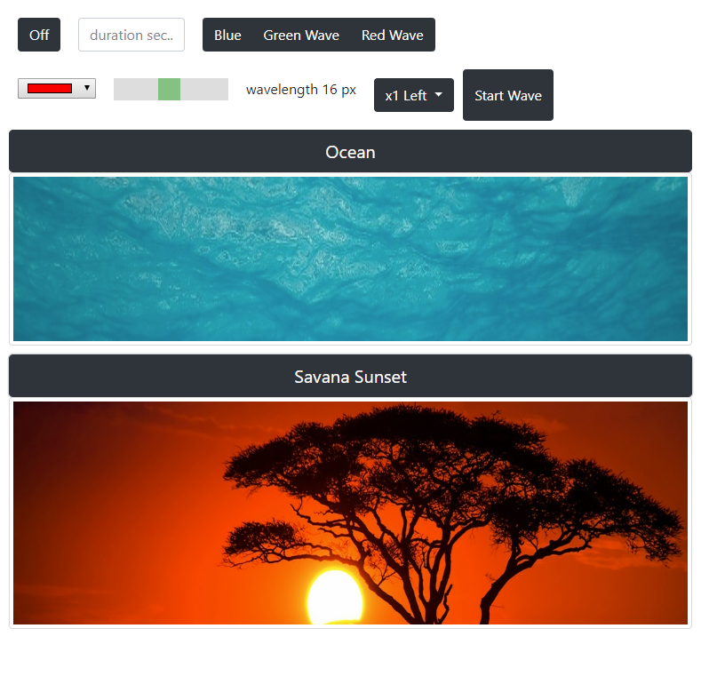

# Overview
Exploring image search techniques using transformer models.

# Demo
The demo was made with `streamlit`


# Test
Models :
* CLIP : `openai/clip-vit-base-patch32`
* ViT : `google/vit-base-patch16-224`
* Swin-v2 : `microsoft/swinv2-base-patch4-window16-256`

## Test images
The test images are available here
- https://www.homesmartmesh.com/
- https://github.com/HomeSmartMesh/website/tree/main/public/images

Two images have been cropped and the cropped images have been input for search in the full images dataset

### Savana Scene

Full image



Test image


### home model

Full image


Cropped image


# Results
|Test image |model | hit position | similarity|
|-----------|------|--------------|-----------|
| savana scene|Swin-V2 | 1st  |0.21 |
| savana scene|CLIP | 1st  |0.68 |
| savana scene|ViT | 3rd |  0.15 |
| home model|Swin-V2 | 5th  |0.35 |
| home model|CLIP | 96th |  0.44 |
| home model|ViT | 7th  |0.39 |

## Concepts
* Content-Based Image Retrieval (CBIR)
* Image Recognition
* Feature Extraction
* Semantic Search using trnasformers
## Tools and libraries
* OpenCV
* Scikit-Image
* Pillow/PIL
* TensorFlow and PyTorch
* Elasticsearch and other search engines like typesense

## Image similarities
* https://huggingface.co/blog/image-similarity

## Image based transformers
* CLIP : Contrastive Language–Image Pre-training

# Setup
transformers require PyTorch to be installed
* https://pytorch.org/get-started/locally/

```cmd
pip3 install torch torchvision torchaudio
```
